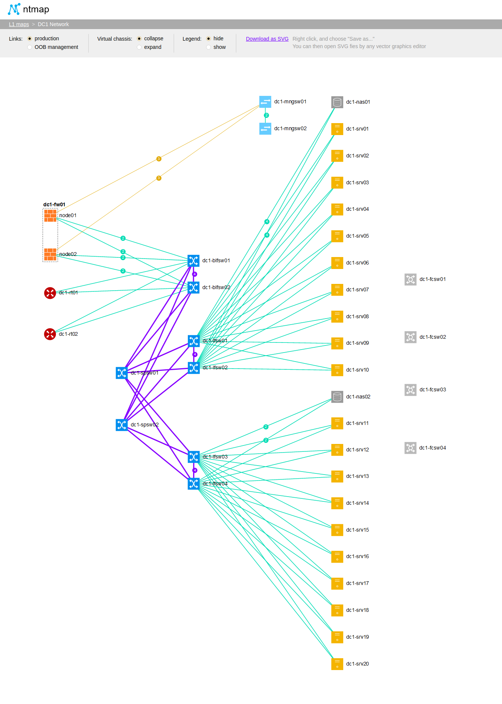
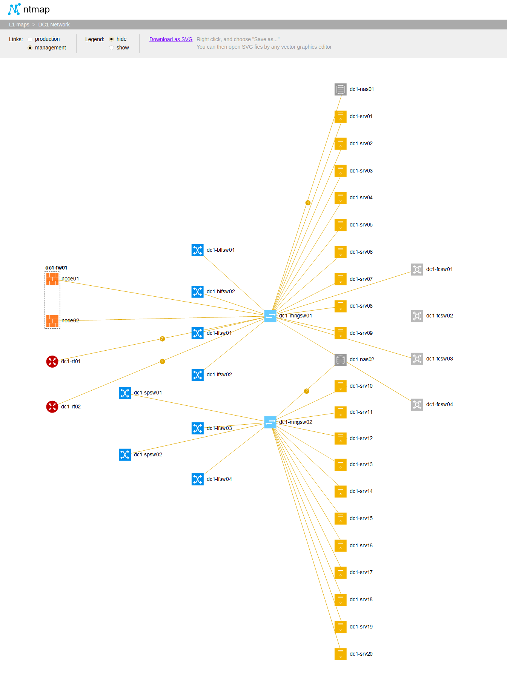

# Ntmap

Ntmap is a tool to visualize network topologies using [Netbox](https://github.com/netbox-community/netbox) as a data source.


## Dependencies

- Netbox 2.8.8
- Python 3.x
- PostgreSQL
- Gunicorn
- NGINX
- D3.js


## Installation

Before installing Ntmap, you need to prepare the needed environment. Examples below are relevant to Ubuntu. For other systems you need to change the installation process appropriately.


### PostgreSQL Setup

Install PostgreSQL:
```
apt-get install -y postgresql libpq-dev
```

At a minimum, we need to create a database for Ntmap and assign it a username and password for authentication. This is done with the following commands (do not use a password from this example):

```
# sudo -u postgres psql
postgres=# CREATE DATABASE ntmap;
CREATE DATABASE
postgres=# CREATE USER ntmap WITH PASSWORD 'ntmap';
CREATE ROLE
postgres=#  GRANT ALL PRIVILEGES ON DATABASE ntmap TO ntmap;
GRANT
postgres=# \c ntmap 
You are now connected to database "ntmap" as user "postgres".
ntmap=# CREATE TABLE ntmap_l1_groups (
	id 		SERIAL PRIMARY KEY,
	name 	VARCHAR(300) NOT NULL CHECK (name <> '') UNIQUE
	);
CREATE TABLE
ntmap=# CREATE TABLE ntmap_l1_maps (
	id 			SERIAL PRIMARY KEY,
	name 		VARCHAR(300) NOT NULL CHECK (name <> '') UNIQUE,
	group_id 	INT REFERENCES ntmap_l1_groups(id),
	scheme 		VARCHAR(2000)
	);
CREATE TABLE
ntmap=# GRANT USAGE, SELECT ON SEQUENCE ntmap_l1_maps_id_seq TO ntmap;
GRANT
ntmap=# GRANT USAGE, SELECT ON SEQUENCE ntmap_l1_groups_id_seq TO ntmap;
GRANT
ntmap=# GRANT ALL PRIVILEGES ON TABLE ntmap_l1_groups TO ntmap;
GRANT
ntmap=# GRANT ALL PRIVILEGES ON TABLE ntmap_l1_maps TO ntmap;
GRANT
postgres=# \q
```


### Ntmap Setup

Download the latest release from GitHub as a ZIP archive and extract it to your desired path. In this example, we'll use /opt/ntmap.
```
# wget https://github.com/den-it/ntmap/archive/master.zip
# sudo unzip master.zip -d /opt
# mv /opt/ntmap-master /opt/ntmap
```

Ntmap stores its own data in PostgreSQL DB. In the example above we used local PostgreSQL installation. If you want to use a remote DB, you can change this in the settings.ini file.

Ntmap doesn't use Netbox API due to perfomance issues. It fetches Netbox data directly from Netbox DB. You need to set up a connect string to Netbox DB also in settings.ini file. **Note:** if you use remote PostgreSQL installation, ensure that your PostgreSQL is ready to accept connections from your machine (pay attention to iptables and PostgreSQL configuration).

```
# cd /opt/ntmap/backend/app
# cp example.settings.ini settings.ini
# nano settings.ini  # change Ntmap and Netbox DB connect strings here
```

Edit Ntmap frontend settings. You need to set NETBOX_URL in settings.js to point to your Netbox installation:
```
# cd /opt/ntmap/www/js
# cp example.settings.js settings.js
# nano settings.js  # change Netbox URL here
```


### Python & Gunicorn Setup

Install Python:
```
# apt-get install -y python3.6 python3-pip
```

We'll use a Python virtual environment to ensure Ntmap's required packages don't conflict with anything in the base system. This will create a directory named venv in our Ntmap root.
```
# sudo apt-get install python3.6-venv
# sudo python3.6 -m venv /opt/ntmap/venv
# source /opt/ntmap/venv/bin/activate
```

Install psycopg2:
```
(venv) # pip3 install psycopg2-binary
```

Install Gunicorn:
```
(venv) # pip3 install gunicorn
(venv) # deactivate
```

### Service Setup

Add ntmap user to your system:
```
# groupadd --system ntmap
# adduser --system --ingroup ntmap ntmap
# chown --recursive ntmap /opt/ntmap
# chgrp -R ntmap /opt/ntmap
```

We'll use systemd to control the daemonization of Ntmap services. First, copy service file to systemd directory:
```
# cp /opt/ntmap/install/ntmap.service /etc/systemd/system/
```

Then, start the ntmap service and enable it to initiate at boot time:
```
# systemctl daemon-reload
# systemctl start ntmap
# systemctl enable ntmap
```

You can use the command systemctl status ntmap to verify that the WSGI service is running:
```
# service ntmap status
● ntmap.service - Ntmap WSGI Service
   Loaded: loaded (/etc/systemd/system/ntmap.service; enabled; vendor preset: enabled)
   Active: active (running) since Sun 2020-07-26 10:56:19 MSK; 8min ago
     Docs: https://github.com/den-it/ntmap
 Main PID: 5111 (gunicorn)
    Tasks: 8 (limit: 8218)
   CGroup: /system.slice/ntmap.service
           ├─5111 /usr/bin/python3 /usr/local/bin/gunicorn --pid /var/tmp/ntmap.pid --pythonpath /opt/ntmap/backend --config /opt/ntmap/backend/gunicorn
           ├─5114 /usr/bin/python3 /usr/local/bin/gunicorn --pid /var/tmp/ntmap.pid --pythonpath /opt/ntmap/backend --config /opt/ntmap/backend/gunicorn
           ├─5115 /usr/bin/python3 /usr/local/bin/gunicorn --pid /var/tmp/ntmap.pid --pythonpath /opt/ntmap/backend --config /opt/ntmap/backend/gunicorn
		   ...
```

At this point, you should be able to connect to the HTTP service at the server name or IP address you provided.


### NGINX Setup

Install NGINX.
```
# apt-get install -y nginx
```

Once NGINX is installed, copy the default NGINX configuration file to /etc/nginx/sites-available/ntmap. Be sure to use the domain name (or IP address) of your installation and appropriate path to html files.
```
# cp /opt/ntmap/install/nginx.conf /etc/nginx/sites-available/ntmap
```

Then, delete /etc/nginx/sites-enabled/default and create a symlink in the sites-enabled directory to the configuration file you just created:
```
# cd /etc/nginx/sites-enabled/
# rm default
# ln -s /etc/nginx/sites-available/ntmap
```

Finally, restart the NGINX service to use the configuration you just provided:
```
# service nginx restart
```

You can open a web browser and use Ntmap now.


### NGINX Auth Setup

Ntmap doesn't provide internal auth methods. If you want to open Ntmap data only for a list of allowed users, you can use the simple auth mechanism of NGINX.

First you need to generate a password file - htpasswd. It can be done by OpenSSL, Apache Utilities or even using online htpasswd generators. In the example below we use Apache Utilities:
```
# apt-get install apache2-utils
# htpasswd -c /etc/nginx/.htpasswd user1
```

You will be asked to supply and confirm a password for the user. Leave out the -c argument for any additional users you wish to add:
```
# htpasswd /etc/nginx/.htpasswd user2
```

Then, you need to edit NGINX configuration: 
```
# nano /etc/nginx/sites-available/ntmap
```

Just add a section below to your config:
```
location / {
	auth_basic "Restricted Content";
	auth_basic_user_file /etc/nginx/.htpasswd;
}
```

Then restart the NGINX service to use new configuration:
```
# service nginx restart
```

To confirm that your content is protected, try to access your Ntmap site in a web browser.


## Usage

### Start using Ntmap

The usage of Ntmap is very simple. You can have several (or many) network topology maps. All maps are organized in groups for better structurization.

To edit groups of maps or maps themselves just click **lock** symbol on the "L1 maps" page. You will enter edit mode. Add needed groups and maps.

To define a map give it a name and describe devices you want to display in the "Scheme" field. Example:
```
dc1-rt, dc1-fw
dc1-spsw
dc1-blfsw, dc1-lfsw
dc1-mngsw
dc1-srv, dc1-nas
dc1-
```

Ntmap will search Netbox database for given name patterns and will display found devices on map. Each line of the scheme represents a level at which a found device will be displayed on the final graph.

The example scheme above can generate a network graph for production links like this:



And a network graph for management links like this:



### Changing Ntmapap Settings

#### New Icons

You can add your own icons to Ntmap graphs. To do this, you need to create new SVG-images with dimensions 32 x 32 pixels in ```www/img``` directory and list them in DEVICE_ROLES variable in file ```settings.js```.

For example, 
```
var DEVICE_ROLES = {
	"Router": 						"router.svg",
	"Firewall": 						"firewall.svg",
	"Unknown": 					"unknown.svg"
}
```
defines that all devices with role "Router" found in Netbox will be depicted by **router.svg** and all firewalls will be shown as **firewall.svg**. All other devices will be shown as **unknown.svg** (question mark icon).


#### Maximum Devices at One  Level

You can limit the maximum number of devices depicted at one level of your maps. This is relevant when you want to prevent Ntmap consuming too much CPU and memory of your machine. Large maps can be resourse-demanding.

To do this change **max_devices_at_one_level** variable in ```settings.ini```. For changes to take effect, you need to restart Ntmap service.


## Providing Feedback

Feature requests and bug reports are welcomed as GiHub issues.
